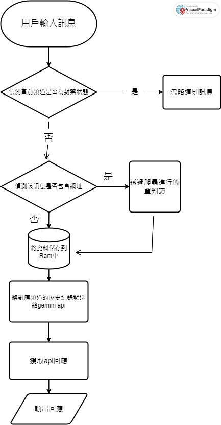
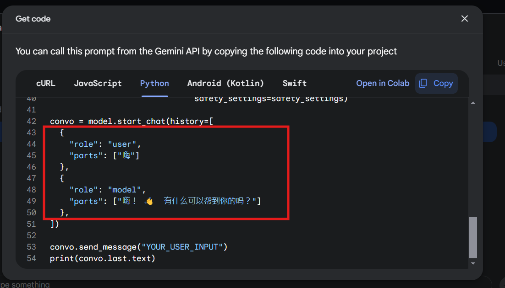
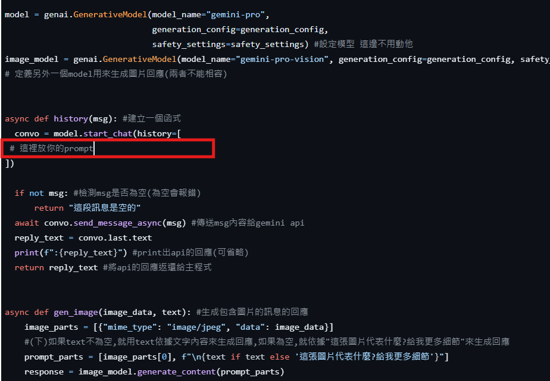
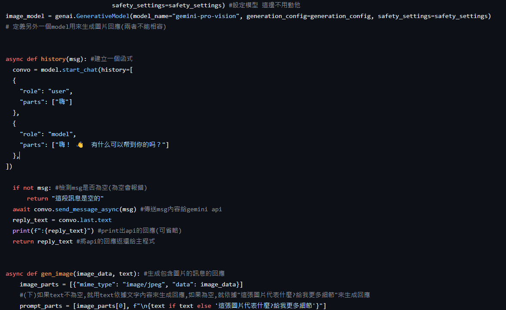
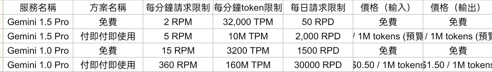

# 介紹
這是一個利用google開發的gemini模型的api來連接discord機器人的Chat bot

* 頻道具有黑白名單兩種模式(請見**常見問題**)

* 文字聊天具有短期記憶功能(記憶句數上限可自訂)

* 能夠進行圖片辨識

* 能在DM channel中使用

* 能通過爬蟲簡單理解網址內容

## 運作邏輯
### 記憶邏輯
機器人記憶是用python字典的格式來儲存在記憶體中

格式如下
```py
{"頻道id1": "value1", "頻道id2": "value2", "頻道id3": "value3"}
```
當用戶發送訊息時，會將訊息儲存到字典中頻道id對應的value，然後再將值發送給api，藉此達成短期記憶的能力

**不過並非長期記憶，只要重開機記憶體裡面的資料就會消失**
### 流程圖


## 指令(預設為黑名單模式)
**以下所有指令都不需要任何prefix或mention**

*注意:以下指令都沒有設定任何權限限制,任何人都能使用*

* blockchannel ➡️ 不再接收當前頻道的訊息(封鎖頻道)
* unblockchannel ➡️ 解除當前頻道的封鎖
* blockserver ➡️ 不再接收當前伺服器**所有頻道**的訊息
* reset ➡️ 清除該用戶的短期記憶
## 注意事項
*私訊(dm channel)和伺服器頻道的使用方法是一模一樣的*

*這個版本是***每則訊息都會回覆**, **不需要mention**。*所以一次太多訊息他會卡住*

*回覆時機器人和真人用戶都會回覆,所以如果你有其他機器人建議用私訊(dm)使用,不然機器人們可能會吵起來*

*blockchannel和unblockchannel指令需要等他處理完前面堆積的api請求才會執行*

**每個頻道的短期記憶是分開的**,*reset只會清空當前頻道的短期記憶*

*短期記憶的上限包含機器人的回覆*

*短期記憶僅包含文字回應,不包含圖片回應*
## 前置作業
將需要的機器人設定填入config.json中

這樣就完成前置作業了
# 常見問題
## 我想要把channel.json改成頻道白名單而不是黑名單怎麼辦
如果想要讓機器人只會回覆channel.json裡面的頻道的訊息,而不是封鎖裡面的頻道

請使用專案中的**main_whitelist.py**

Def.py無須更改

**白名單版本的指令如下:**

*注意:以下指令都沒有設定任何權限限制,任何人都能使用*
* openchannel ➡️ 將當前頻道加入白名單
* closechannel ➡️ 將當前頻道移出白名單
* reset和原版相同


## 如何取得gemini api key
1.前往gemini的網站 [**點我**](<https://makersuite.google.com/>)

2.登入你的google帳號(要帳戶年滿18歲) [**詳情點我**](<https://ai.google.dev/available_regions?hl=zh-tw>)

3.打勾同意用戶條款然後按繼續


4.點get api key


5.點create api key(如果還沒有建立專案就點create api key in new project)


6.這樣就得到api key囉 點copy就能複製


## 如何產生訓練prompt
1.前往gemini的網站 [**點我**](<https://makersuite.google.com/>)

2.點create new,然後選Chat prompt


3.先隨便打點東西然後按Save

名字不取也沒關係可以直接按Save

4.匯出你的prompt
點擊右上角的Get code就能匯出


選Python 然後往下滑一點

這段就是你的prompt了


5.回到Def.py



把框起來的那段換成自己的prompt就可以囉



* User的地方就是你要問的問題
* Model的地方就是你想要他怎麼回答

也可以直接用對話紀錄然後把你想要模擬的對象放在Model的地方,自己放在User的地方

只要複製prompt的格式並且更改裡面內容即可

## The caller does not have permisson
當你點擊創建api key的時候,可能會出現下面的錯誤

**The caller does not have permisson**

這可能是由於你刪除了你的前一個api key

這種情況建議用另一個沒創過api key的帳號

重新創建一個api key

## Reset指令無效
抱歉,我們的錯,我們的程式出現了bug

請下載最新版的code,我們已經解決了

## No such file or directory: 'config.json/channel.json'
如果你出現以上錯誤表示找不到你的檔案，請檢查你的檔案是否在正確路徑上

如果確定檔案存在，請確認檔案路徑上沒有兩個相同名稱的資料夾

例如: "C:\Dowloads\bot\bot\main.py"

這種路徑就容易會發生錯誤，請嘗試將機器人資料夾換個位置

如果還是沒有解決，請嘗試以下方法:

把
```py
#只要有這段的地方都需要改
data = json.load(open("config.json", encoding="utf-8"))
```
改成
```py
# 要先import os
current_dir = os.path.dirname(__file__)
config_path = os.path.join(current_dir, "config.json")
data = json.load(open(config_path, encoding="utf-8"))
```
channel.json也是同理
```py
#只要有這段的地方都需要改
with open('channel.json', 'w', encoding='utf-8') as file:
    json.dump(data, file, ensure_ascii=False, indent=2)
```
改成
```py
#要先import os
current_dir = os.path.dirname(__file__)
config_path = os.path.join(current_dir, "channel.json")
with open(config_path, 'w', encoding='utf-8') as file:
    json.dump(data, file, ensure_ascii=False, indent=2)
```
這樣應該就能解決問題了，其他問題可以到Issues或Dc私訊"yimang__"

## Gemini不同模型的選擇
近期gemini有釋出了免費的1.0和1.5版本

都是可以免費使用，相關的限速限制如下圖


如果是使用免費版本的話建議使用1.0

1.5雖然模型經過優化但限速很嚴重

更改模型只要到Def.py的
```py
model = genai.GenerativeModel(model_name="gemini-1.0-pro",
                              generation_config=generation_config,
                              safety_settings=safety_settings) #設定模型 這邊不用動他
image_model = genai.GenerativeModel(model_name="gemini-pro-vision", generation_config=generation_config, safety_settings=safety_settings)
```
這一段

將
```py
model_name="gemini-1.0-pro"
```
更改為
```py
model_name="gemini-1.5-pro"
```
即可
可以根據自身想要的模型做更改