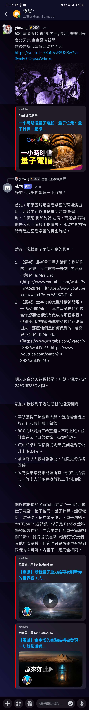

# Gemini Discord Bot
[](https://www.python.org/)
[](https://github.com/Rapptz/discord.py)
[](https://github.com/imyimang/discord-gemini-chat-bot/stargazers)
[](https://github.com/imyimang/discord-gemini-chat-bot/forks)
[](https://github.com/imyimang/discord-gemini-chat-bot/blob/main/LICENSE)

## [English](README_EN.md) | 繁體中文 

這是一個利用 Google Gemini 模型的 API 來製作的 Discord AI 聊天機器人

## 功能
- 短期記憶
- 圖片辨識
- 爬取網址 Title 簡單判斷內容
- 透過 Wolframalpha 搜尋內容
- 透過 Google 搜尋內容
- 爬取 NOWnews 各版新聞
- 搜尋 Youtube 影片

## Demo
<details>
  <summary>點擊查看</summary>
  
</details>

## 安裝
將機器人設定填入 `.env.example` 中，然後將它重新命名為 `.env`

> [!WARNING]  
> 外部工具調用預設為關閉，如果要開啟請將 `CALL_TOOLS = false` 更改為 `CALL_TOOLS = true`
> 並填入對應的 API Key

安裝函式庫:
```powershell
pip install -U -r requirements.txt
```
將 prompt 放入 `prompt.txt` (可略過) [教學](docs/zh/q7.md)

將 history 放入 `call_api.py` (可略過) [教學](docs/zh/q3.md)

執行 `main.py`


## 介紹
- [運作原理](docs/zh/principles.md)
- [指令](docs/zh/commands.md)
- [更新日誌](docs/zh/log.md)

## 常見問題
- [如何取得 Gemini API key?](docs/zh/q2.md)
- [如何撰寫提示詞?](docs/zh/q7.md)
- [如何產生訓練用的history?](docs/zh/q3.md)
- [Error:The caller does not have permisson](docs/zh/q4.md)
- [Error:No such file or directory: 'config.json/channel.json'](docs/zh/q5.md)
- [Gemini 不同模型的選擇](docs/zh/q6.md)


# 參考資料
- [Echoshard/Gemini_Discordbot](https://github.com/Echoshard/Gemini_Discordbot)
- [peter995peter/discord-gemini-ai](https://github.com/peter995peter/discord-gemini-ai)