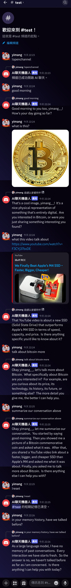

# Gemini Discord Bot
[](https://www.python.org/)
[](https://github.com/Rapptz/discord.py)
[](https://github.com/imyimang/discord-gemini-chat-bot/stargazers)
[](https://github.com/imyimang/discord-gemini-chat-bot/forks)
[](https://github.com/imyimang/discord-gemini-chat-bot/blob/main/LICENSE)

## English | [繁體中文](README.md)

This is a Discord AI chatbot created using the Google Gemini model's API.

## Features
- Short-term memory  
- Image recognition  
- Simple web link title extraction and content detection  
- Content search via WolframAlpha  
- Content search via Google  
- News crawling from various NOWnews sections  
- YouTube video search  

## Demo
<details>
  <summary>Click to view</summary>
  
</details>

## Installation
Fill in the bot configuration in `.env.example`, then rename it to `.env`.

> [!WARNING]  
> External tool calling is disabled by default. To enable it, change `CALL_TOOLS = false` to `CALL_TOOLS = true`,  
> and provide the corresponding API keys.

Install dependencies:
```powershell
pip install -U -r requirements.txt
```

Put your prompt into `prompt.txt` (optional) [Tutorial](docs/zh/q7.md)

Place your message history logic into `call_api.py` (optional) [Tutorial](docs/zh/q3.md)

Run `main.py`

## Introduction
- [How it works](docs/en/principles_en.md)
- [Commands](docs/en/commands_en.md)
- [Changelog](docs/en/log_en.md)

## FAQ
- [How to get a Gemini API key?](docs/en/q2_en.md)
- [How to write prompts?](docs/en/q7_en.md)
- [How to generate training history?](docs/en/q3_en.md)
- [Error: The caller does not have permission](docs/en/q4_en.md)
- [Different Gemini model options](docs/en/q6_en.md)

# References
- [Echoshard/Gemini_Discordbot](https://github.com/Echoshard/Gemini_Discordbot)
- [peter995peter/discord-gemini-ai](https://github.com/peter995peter/discord-gemini-ai)