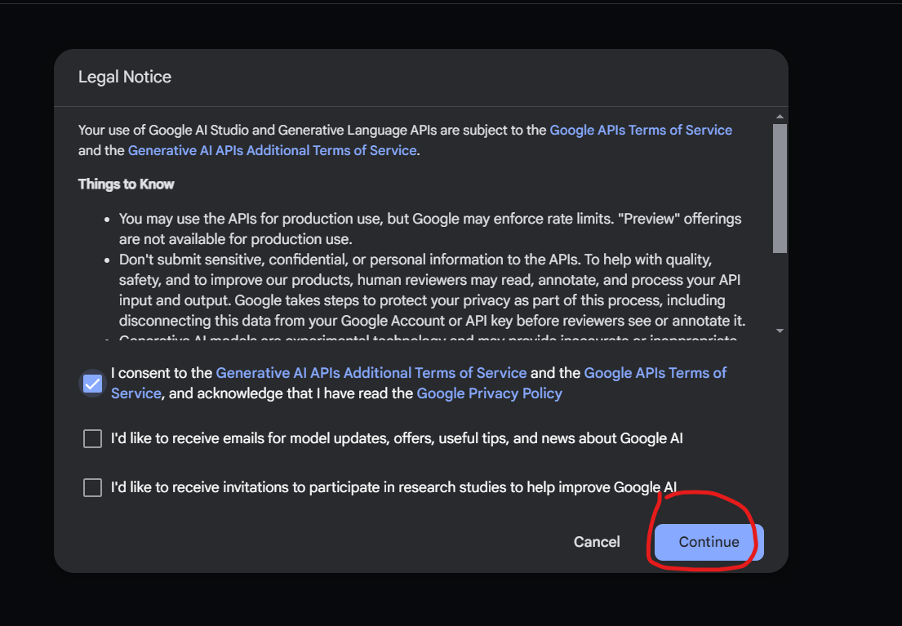
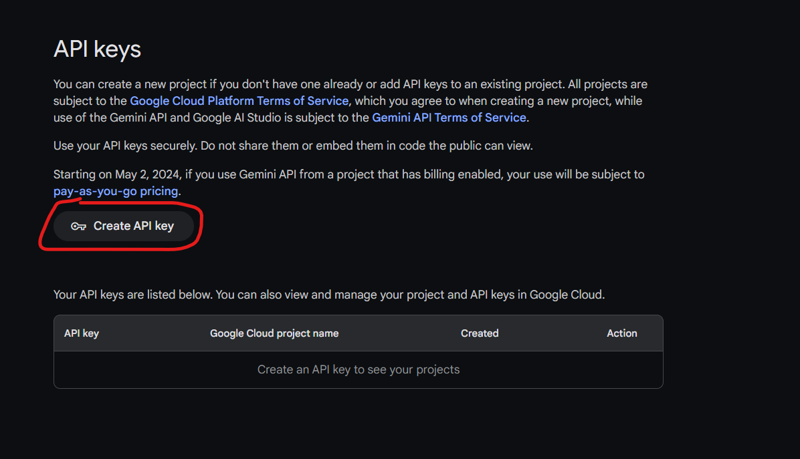

## How to get Gemini api key

1. Visit the Gemini website. [**click me**](<https://makersuite.google.com/>)

2. Log in to your Google account (account must be at least 18 years old) [**Click here for details**](<https://ai.google.dev/available_regions?hl=zh-tw>)

3. Check the box to agree to the terms of service and then click "Continue".

4. Click "Get API key"

5. Click "Create API key" (if you don't have project yet then click "create api key in new project")

6. You've now obtained the API key. Click "Copy" to copy it.
