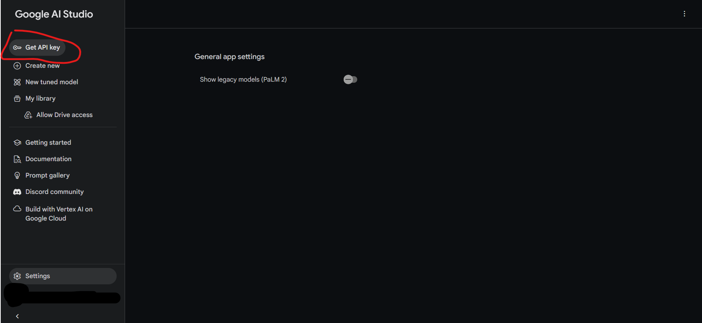
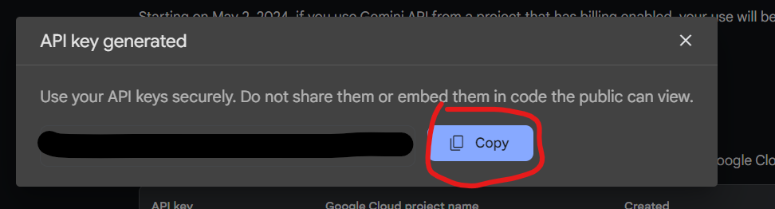

## 如何取得 Gemini api key?

1. 前往 Gemini的網站 [**點我**](<https://makersuite.google.com/>)

2. 登入你的 Google 帳號 (要帳戶年滿 18 歲) [**詳情點我**](<https://ai.google.dev/available_regions?hl=zh-tw>)

3. 打勾同意用戶條款然後按繼續

4. 點 "Get API key"

5. 點 "Create API key" (如果還沒有建立專案就點 "create api key in new project")

6. 這樣就得到 API key 了，點 "Copy" 就能複製
