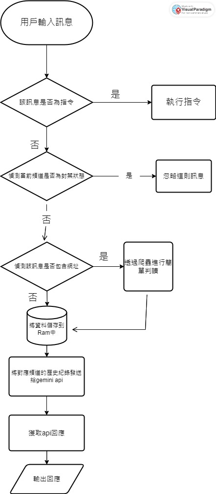

機器人記憶是用 Python 字典的格式來儲存在記憶體中，channel.json 則負責記憶頻道黑/白名單。

## 記憶邏輯
格式如下
```py
{'頻道id1': 'value1', '頻道id2': 'value2', '頻道id3': 'value3'}
```
當用戶發送訊息時，會將訊息儲存到字典中頻道 id 對應的 value，然後再將值發送給api，藉此達成短期記憶的能力。

**不過並非長期記憶，只要重開機記憶體裡面的資料就會消失。**

## 流程圖


> [!WARNING]  
> 當伺服器數量達到一定數量後，黑名單模式可能會導致on_message偵測十分緩慢，甚至遺漏偵測
