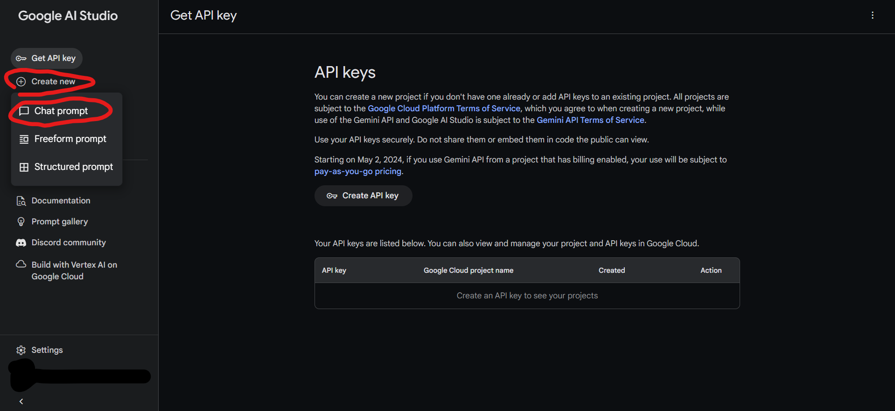
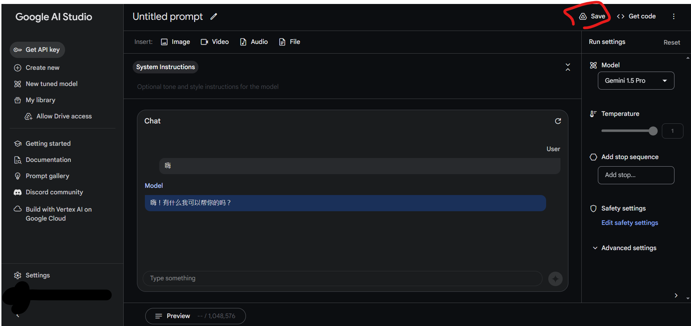
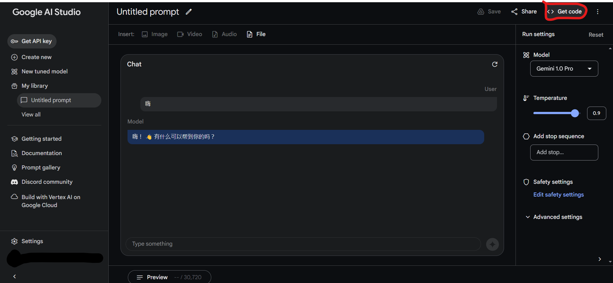
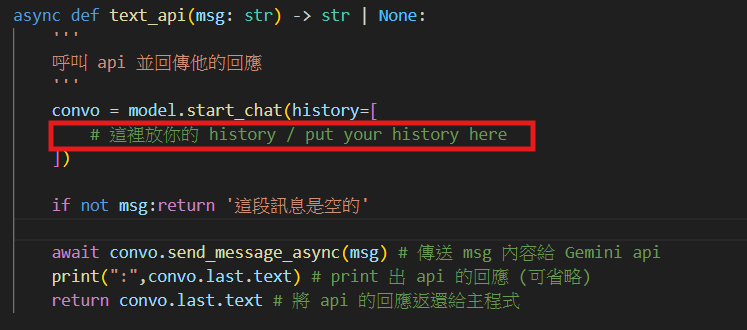
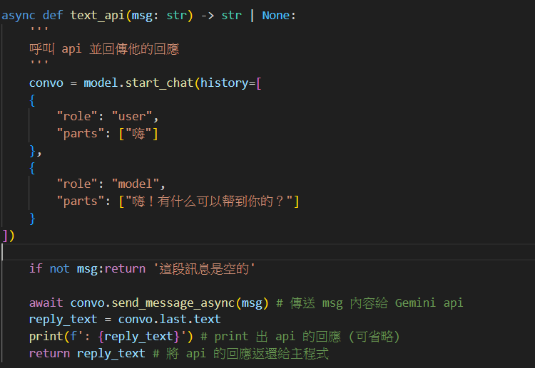

## 如何產生訓練 prompt?
1. 前往 Gemini 的網站 [**點我**](<https://makersuite.google.com/>)

2. 點 "Create new"，然後選 "Chat prompt"

3.先隨便打點東西然後按 "Save"

名字不取也沒關係可以直接按 "Save"

4.匯出你的prompt
點擊右上角的 "Get code" 就能匯出

選 "Python" 然後往下滑一點

這段就是你的prompt了

5.回到 call_api.py

把框起來的那段換成自己的 prompt 就可以囉

* "User" 的地方就是你要問的問題
* "Model" 的地方就是你想要他怎麼回答

也可以直接用對話紀錄然後把你想要模擬的對象放在 "Model" 的地方，自己放在 "User" 的地方

只要複製 prompt 的格式並且更改裡面內容即可